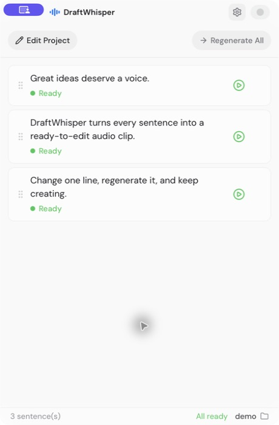

[简体中文](README.zh-CN.md) · English

<p align="center">
  
</p>

<h1 align="center">DraftWhisper</h1>

<p align="center">
  A sentence-level AI voiceover workspace for creators.
</p>

<p align="center">
  <strong>Edit one sentence → Regenerate → Listen → Drag into your editor</strong>
</p>

DraftWhisper is a desktop app for creators who use AI voiceover in their videos. It is designed around a simple fact: a script is rarely final when the edit is already underway.

With most TTS tools, changing one line means regenerating a long recording, finding the replacement, and manually moving it back into the editing timeline. DraftWhisper treats every sentence as an independent audio clip, so the smallest script change can stay a small change.

<p align="center">
  
</p>

<p align="center">
  <em>The workspace shown in English: every sentence has its own status, playback, and regeneration controls.</em>
</p>

## Download

Download the latest published desktop build from [GitHub Releases](https://github.com/caviar1031/draft-whisper/releases/latest).

1. Open the latest release and expand **Assets**.
2. Download `DraftWhisper_<version>_aarch64.dmg`. The MVP release currently supports Apple Silicon only; an Intel build is not available yet.
3. Open the downloaded `.dmg` and drag DraftWhisper into the **Applications** folder.
4. Launch DraftWhisper from **Applications**. The current release builds are unsigned and not notarized; if the system blocks the app, use **System Settings → Privacy & Security → Open Anyway**.

The current published release is still macOS-only. Windows support is available when building from source, but a Windows installer has not been published yet.

## Platform support

| Capability          | macOS                                          | Windows                                                     |
| ------------------- | ---------------------------------------------- | ----------------------------------------------------------- |
| Window integration  | System title bar and macOS vibrancy            | Custom Windows title bar and platform-specific transparency |
| API key storage     | macOS Keychain                                 | Windows Credential Manager                                  |
| Native file handoff | Native drag, Finder reveal, and clipboard copy | Native OLE/Shell drag, File Explorer reveal, and clipboard copy |
| Published build     | Apple Silicon DMG                              | Build from source for now                                   |

## What problem does it solve?

AI voiceover is fast to create, but slow to revise. The painful moment usually happens after the first draft:

1. One sentence no longer matches the cut.
2. The creator edits the script.
3. The whole voiceover has to be regenerated or downloaded again.
4. The replacement clip has to be located, checked, and put back into the editor.

DraftWhisper shortens that loop to one sentence. It keeps the script, voice settings, current audio, and recent versions together in a local project, then hands each finished WAV clip directly to the editing app.

## The core workflow

| Step | What happens |
| --- | --- |
| 1. Import | Paste a script or enter one line per sentence. DraftWhisper can split a script automatically. |
| 2. Choose a voice | Use a preset, describe a new voice, or select a local voice-clone sample. |
| 3. Generate | Create independent WAV clips with visible per-sentence progress and errors. |
| 4. Review | Play a single sentence, edit its text, retry it, or switch among its five latest versions. |
| 5. Hand off | Drag the clip into CapCut, Premiere, DaVinci Resolve, Final Cut Pro, or another editor. |

## Why sentence-level audio matters

| Traditional long-form TTS workflow | DraftWhisper workflow |
| --- | --- |
| Regenerate a long recording for a small text change | Regenerate only the changed sentence |
| Search through files for the replacement | The replacement stays on the sentence card |
| Review happens across pages, downloads, and the timeline | Play and compare versions in one workspace      |
| Old audio is easy to overwrite or lose | Keep the five most recent versions per sentence |
| Export, locate, and import manually | Drag the audio file directly into the editor |

## What you can do

- **Work sentence by sentence** — paste a script, preview automatic splitting, or enter manual lines.
- **Generate in batches** — use configurable concurrency and see queued, generating, ready, and failed states.
- **Revise without starting over** — edit one sentence and regenerate only that sentence.
- **Keep useful history** — retain and switch between the five latest audio versions for each sentence.
- **Shape the voice** — use MiMo preset voices, text-based voice design, or WAV/MP3 voice cloning.
- **Direct the performance** — add optional free-text performance direction for basic and clone modes.
- **Preview voices separately** — test a voice without adding the preview to a sentence's history.
- **Move audio into the edit** — drag or copy files natively on macOS and Windows, and reveal them in Finder or File Explorer.
- **Keep work organized locally** — store scripts, voice settings, samples, and cached audio by project.

## Built for creators in the middle of an edit

DraftWhisper is intentionally a focused workspace, not a general-purpose writing assistant, a timeline editor, or a web TTS dashboard. Its job is to make the repeated “change one line and keep going” moment quick and predictable.

It fits especially well into workflows for:

- YouTube, Bilibili, and short-form video creators
- AI tutorial and knowledge-sharing videos
- Product demos, explainers, and social content
- Any edit where the script keeps changing after the first voiceover pass

## Local-first storage

- Project metadata and non-sensitive preferences are stored locally.
- API keys are stored per configuration in the platform credential store—macOS Keychain or Windows Credential Manager—not in `localStorage`.
- Generated audio and voice-clone samples are cached on the local machine.
- A clone sample is sent to MiMo only when a clone generation or preview request is made.

## Current provider and voice modes

The provider layer is designed to grow, but the current MVP ships with Xiaomi MiMo v2.5:

| Provider | Protocol | Default base URL | Modes |
| --- | --- | --- | --- |
| Xiaomi MiMo | Chat Completions-style TTS | `https://api.xiaomimimo.com/v1` | Basic voice, voice design, voice clone |

Default model mappings for a new MiMo configuration:

| Capability | Default model |
| --- | --- |
| Basic voice | `mimo-v2.5-tts` |
| Voice design | `mimo-v2.5-tts-voicedesign` |
| Voice clone | `mimo-v2.5-tts-voiceclone` |

See the [MiMo v2.5 speech synthesis documentation](https://mimo.mi.com/docs/zh-CN/quick-start/usage-guide/audio/speech-synthesis-v2.5) for API access and account details.

Voice-clone samples are checked locally before storage or upload: they must be valid WAV or MP3 files, shorter than 30 seconds, and under MiMo's 10 MB limit after conversion to a complete Base64 Data URI.

## Quick start

### Requirements

- Recent Node.js and npm
- Rust and Cargo compatible with the Tauri toolchain (Rust 1.77.2 or newer)
- A MiMo API key

Platform-specific requirements:

- **macOS:** Xcode Command Line Tools (`xcode-select --install`).
- **Windows:** Microsoft C++ Build Tools with the **Desktop development with C++** workload, Microsoft Edge WebView2 Runtime, and the stable MSVC Rust toolchain. WebView2 is normally already installed on current Windows versions.

See the official [Tauri prerequisites](https://v2.tauri.app/start/prerequisites/) for installation details.

### Run the desktop app

```bash
npm install
npm run tauri dev
```

After installing Rust on Windows, reopen PowerShell so Cargo is added to `PATH`. If the current terminal still cannot find `cargo`, add its default directory for this session and start the app again:

```powershell
$env:Path = "$env:USERPROFILE\.cargo\bin;$env:Path"
npm run tauri dev
```

On first launch:

1. Open **Settings** and add a MiMo API configuration.
2. Enter the API key and test the capabilities you want to use.
3. Import a script, choose a voice mode, and generate the sentence audio.

For front-end-only work, use `npm run dev`. Tauri commands and native macOS/Windows integrations require the desktop command.

## Development commands

| Command | Purpose |
| --- | --- |
| `npm run dev` | Start Vite for front-end-only development |
| `npm run tauri dev` | Start the complete Tauri desktop app |
| `npm run build` | Type-check and build the front end |
| `npm run tauri build` | Build the production desktop bundle |
| `npm run lint` | Run Biome checks |
| `npm run lint:fix` | Apply Biome lint fixes |
| `npm run format` | Format the repository with Biome |
| `npm test` | Run front-end and Rust tests |
| `cargo check --manifest-path src-tauri/Cargo.toml` | Check the Rust backend |

## Architecture

```text
React + TypeScript + Zustand
          │ Tauri IPC
          ▼
Rust + reqwest ──────► Xiaomi MiMo v2.5 TTS API
          │
          ├─ project metadata and preferences: localStorage
          ├─ API keys: platform credential store
          └─ WAV files and voice samples: local cache
```

The front end owns project and settings state. The Rust side handles HTTP requests, file I/O, audio caching, credential storage, and platform-native integrations. Generated audio is stored as local WAV files so it can be played, copied, revealed, or dragged into another app.

## Current MVP scope

Included: script import, sentence splitting, batch generation, playback, single-sentence regeneration, five-version history, local projects, voice design, voice cloning, local caching, settings, and English/Simplified Chinese UI.

Not included yet: cloud sync, waveform editing, timeline editing, subtitles, and additional providers beyond MiMo.

## License

[MIT](LICENSE)
