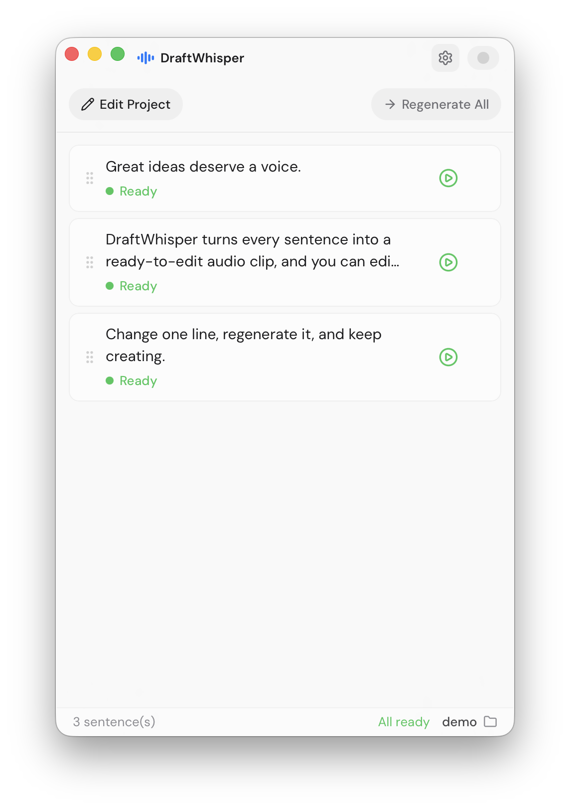

[English](README.md) · 简体中文

<p align="center">
  
</p>

<h1 align="center">DraftWhisper</h1>

<p align="center">
  面向创作者的逐句 AI 配音工作台
</p>

<p align="center">
  <strong>改一句文案 → 重新生成 → 立即试听 → 拖进剪辑软件</strong>
</p>

DraftWhisper 是一款桌面配音工具，服务于正在剪视频、做教程、制作短视频或持续修改脚本的创作者。

它解决的是一个很具体、但会反复消耗时间的问题：**脚本不会在第一次配音后就定稿。**

传统 TTS 工具通常把整篇稿子当成一条长音频。改动其中一句后，创作者往往要重新生成或下载整段录音，再找出替换片段，最后手动放回剪辑时间线。DraftWhisper 把每句话当作独立的音频片段，让一次小修改保持为一次小修改。

<p align="center">
  
</p>

## 下载发行版

前往 [GitHub Releases](https://github.com/caviar1031/draft-whisper/releases/latest) 下载最新的桌面发行版。

当前已发布的 `v0.1.0` 仅包含 Apple Silicon DMG。使用新的跨平台流水线构建下一版本后，Release 将增加 macOS Intel，以及 Windows x64 的 NSIS 和 MSI 安装包。

1. 打开最新的 Release，并展开 **Assets**。
2. 对于新跨平台流水线生成的 Release，根据平台选择安装包：
   - **macOS Apple Silicon：** 下载名称中包含 `aarch64` 的 `.dmg`。
   - **macOS Intel：** 下载名称中包含 `x86_64` 的 `.dmg`。
   - **Windows x64：** 下载 NSIS `-setup.exe` 安装程序；需要集中部署时也可以使用 `.msi`。
3. macOS 用户打开 `.dmg`，将 DraftWhisper 拖入 **Applications**；Windows 用户直接运行下载的安装程序。
4. 启动 DraftWhisper。当前发行包尚未签名，macOS 构建也尚未公证。如果 macOS 拦截应用，请前往 **系统设置 → 隐私与安全性 → 仍要打开**；如果 Windows 显示 Microsoft Defender SmartScreen，请确认文件来自本仓库后选择 **更多信息 → 仍要运行**。

## 平台支持

| 能力         | macOS                             | Windows                                 |
| ------------ | --------------------------------- | --------------------------------------- |
| 窗口集成     | 系统标题栏与 macOS 毛玻璃效果     | 自定义 Windows 标题栏与平台专属透明效果 |
| API Key 存储 | macOS Keychain                    | Windows 凭据管理器                      |
| 原生文件交付 | 原生拖拽、Finder 定位与剪贴板复制 | 原生 OLE/Shell 拖拽、文件资源管理器定位与剪贴板复制 |
| 自动发布目标 | Apple Silicon 与 Intel DMG        | x64 NSIS 安装程序与 MSI 安装包          |

## 它解决什么问题？

AI 配音本身已经很快，但修改配音仍然很慢。最常见的场景是：

1. 视频剪到一半，发现某句话不符合画面或节奏。
2. 修改脚本文案。
3. 重新生成一整段配音，或重新下载一整个音频文件。
4. 找到替换片段、试听确认，再把它放回剪辑软件。

DraftWhisper 把这条链路缩短到一句话：脚本、声音设置、当前音频和最近版本都在本地项目中按句管理；生成完成后，每句 WAV 文件都可以直接拖进剪辑软件。

## 核心工作流

| 步骤 | 发生什么 |
| --- | --- |
| 1. 导入 | 粘贴脚本并按行输入，一行对应一句；空行会被忽略。 |
| 2. 选择声音 | 使用预置音色、文字描述声音，或选择本地声音克隆样本。 |
| 3. 生成 | 按句生成独立 WAV，并显示排队、生成中、完成和失败状态。 |
| 4. 试听与修改 | 单句播放、编辑、重试，或切换该句最近 5 个音频版本。 |
| 5. 放回剪辑 | 将音频直接拖入剪映、Premiere、DaVinci Resolve、Final Cut Pro 等软件。 |

## 为什么要逐句管理音频？

| 传统长音频 TTS 流程 | DraftWhisper 流程 |
| --- | --- |
| 改一句话也要重新生成整段录音 | 只重新生成发生变化的句子 |
| 在文件夹或下载记录中寻找替换片段 | 替换音频就在对应句卡片上 |
| 在网页、下载目录和时间线之间来回试听 | 在同一工作区播放并比较版本 |
| 旧音频容易被覆盖或丢失 | 每句保留最近 5 个版本 |
| 需要导出、定位、再手动导入 | 直接把音频拖进剪辑软件 |

## 你可以用它做什么？

- **逐句处理脚本**：粘贴文案并手动一行一句，空行会被忽略。
- **批量生成配音**：配置并发数，并观察每句的排队、生成、完成和失败状态。
- **只改需要改的地方**：编辑一句话后，只重新生成这一句。
- **保留可用版本**：每句保留最近 5 个音频版本，随时切换和试听。
- **设计或克隆声音**：使用 MiMo 预置音色、文字声音设计，或 WAV/MP3 声音克隆。
- **导演模式**：使用会话级开关控制逐句编辑；开启时默认聚焦导演指令，关闭时默认聚焦正文。
- **单独试听声音**：试听不会写入句子的音频历史。
- **快速交给剪辑**：macOS 和 Windows 均支持原生拖拽和复制音频文件，并可分别在 Finder 或文件资源管理器中定位。
- **按项目整理工作**：脚本、声音设置、声音样本和音频缓存都可以按本地项目管理。

## 为剪辑过程中的创作者而设计

DraftWhisper 不是通用写作助手、时间线编辑器，也不是把所有功能塞进网页的 TTS 控制台。它只专注于让“改一句、听一下、继续剪”这件事更快、更稳定。

它尤其适合：

- YouTube、Bilibili 和短视频创作者
- AI 教程、知识分享和产品讲解视频
- 产品演示、解说和社交媒体内容
- 首次配音后仍会持续修改脚本的剪辑流程

## 本地优先的数据处理

- 项目元数据和非敏感偏好设置保存在本地。
- API Key 按配置隔离存储在系统凭据存储中（macOS Keychain 或 Windows 凭据管理器），不写入 `localStorage`。
- 生成的音频和声音克隆样本缓存在本机。
- 声音克隆样本只会在发起克隆生成或试听时发送给 MiMo。

## 当前支持的 Provider 与声音模式

DraftWhisper 当前支持三类 Provider 配置：小米 MiMo v2.5、Fish Audio，以及兼容 OpenAI SDK 语音协议的第三方自定义接口。每套 API 配置可以独立保存 API Key、模型、音色和能力映射，并可在项目中切换使用。

| Provider | 协议 | 默认 Base URL | 支持模式 |
| --- | --- | --- | --- |
| Xiaomi MiMo | Chat Completions 风格 TTS | `https://api.xiaomimimo.com/v1` | 基础音色、声音设计、声音克隆 |
| Fish Audio | `/v1/tts` REST API | `https://api.fish.audio/v1/tts` | 基础音色 |
| 自定义配置 | OpenAI SDK 兼容语音请求 | 用户填写完整 Endpoint | 基础音色 |

新建 MiMo 配置时使用以下默认模型映射：

| 能力 | 默认模型 |
| --- | --- |
| 基础音色 | `mimo-v2.5-tts` |
| 声音设计 | `mimo-v2.5-tts-voicedesign` |
| 声音克隆 | `mimo-v2.5-tts-voiceclone` |

API 使用方式和账号信息请参考 [MiMo v2.5 语音合成文档](https://mimo.mi.com/docs/zh-CN/quick-start/usage-guide/audio/speech-synthesis-v2.5)。

Fish Audio 配置默认使用 `s2.1-pro-free`，并提供可编辑的示例音色 ID；具体接入方式请参考 [Fish Audio 快速开始文档](https://docs.fish.audio/developer-guide/getting-started/quickstart)。预置配置会填入默认地址、模型、能力和音色，所有值都可以在设置中修改。

自定义配置不会预填服务商地址、模型或音色。请填写第三方服务的完整语音 Endpoint、API Key、模型 ID 和音色 ID；DraftWhisper 会原样使用该 Endpoint，并通过 Bearer 认证发送标准语音请求。

声音克隆样本在保存或发送前会进行本地校验：必须是签名有效的 WAV 或 MP3 文件，时长小于 30 秒，并且转换为完整 Base64 Data URI 后小于 MiMo 的 10 MB 限制。

## 快速开始

### 环境要求

- 较新版本的 Node.js 与 npm
- 与 Tauri 工具链兼容的 Rust 和 Cargo（Rust 1.77.2 或更高版本）
- 一个 MiMo、Fish Audio 或兼容第三方 TTS API Key

各平台还需要：

- **macOS：** Xcode Command Line Tools（`xcode-select --install`）。
- **Windows：** 安装 Microsoft C++ Build Tools，并选择 **使用 C++ 的桌面开发** 工作负载；同时需要 Microsoft Edge WebView2 Runtime 和稳定版 MSVC Rust 工具链。当前 Windows 版本通常已预装 WebView2。

安装细节请参考 Tauri 官方的[环境依赖说明](https://v2.tauri.app/start/prerequisites/)。

### 启动桌面应用

```bash
npm install
npm run tauri dev
```

在 Windows 安装 Rust 后，请重新打开 PowerShell，让 Cargo 路径生效。如果当前终端仍找不到 `cargo`，可为本次会话补上默认路径，再启动应用：

```powershell
$env:Path = "$env:USERPROFILE\.cargo\bin;$env:Path"
npm run tauri dev
```

首次启动后：

1. 打开 **设置**，添加一套预置或自定义 API 配置。
2. 填入 API Key，并测试准备使用的能力。
3. 导入脚本，选择声音模式，生成逐句音频。

如果只进行前端开发，可以使用 `npm run dev`；Tauri 命令以及 macOS / Windows 原生集成需要通过桌面应用命令运行。

## 开发命令

| 命令 | 用途 |
| --- | --- |
| `npm run dev` | 启动仅包含前端的 Vite 开发服务器 |
| `npm run tauri dev` | 启动完整 Tauri 桌面应用 |
| `npm run build` | 类型检查并构建前端 |
| `npm run tauri build` | 构建生产桌面安装包 |
| `npm run lint` | 运行 Biome 检查 |
| `npm run lint:fix` | 使用 Biome 自动修复 lint 问题 |
| `npm run format` | 使用 Biome 格式化仓库 |
| `npm test` | 运行前端和 Rust 测试 |
| `cargo check --manifest-path src-tauri/Cargo.toml` | 检查 Rust 后端 |

## 架构

```text
React + TypeScript + Zustand
          │ Tauri IPC
          ▼
Rust + reqwest ──────► MiMo、Fish Audio 或自定义 TTS API
          │
          ├─ 项目元数据与偏好设置：localStorage
          ├─ API Key：系统凭据存储
          └─ WAV 音频与声音样本：本地缓存
```

前端负责项目和设置状态；Rust 负责 HTTP 请求、文件读写、音频缓存、凭据存储和各平台原生集成。生成的音频以本地 WAV 文件保存，可以播放、复制、定位或拖入其他应用。

## License

[MIT](LICENSE)
